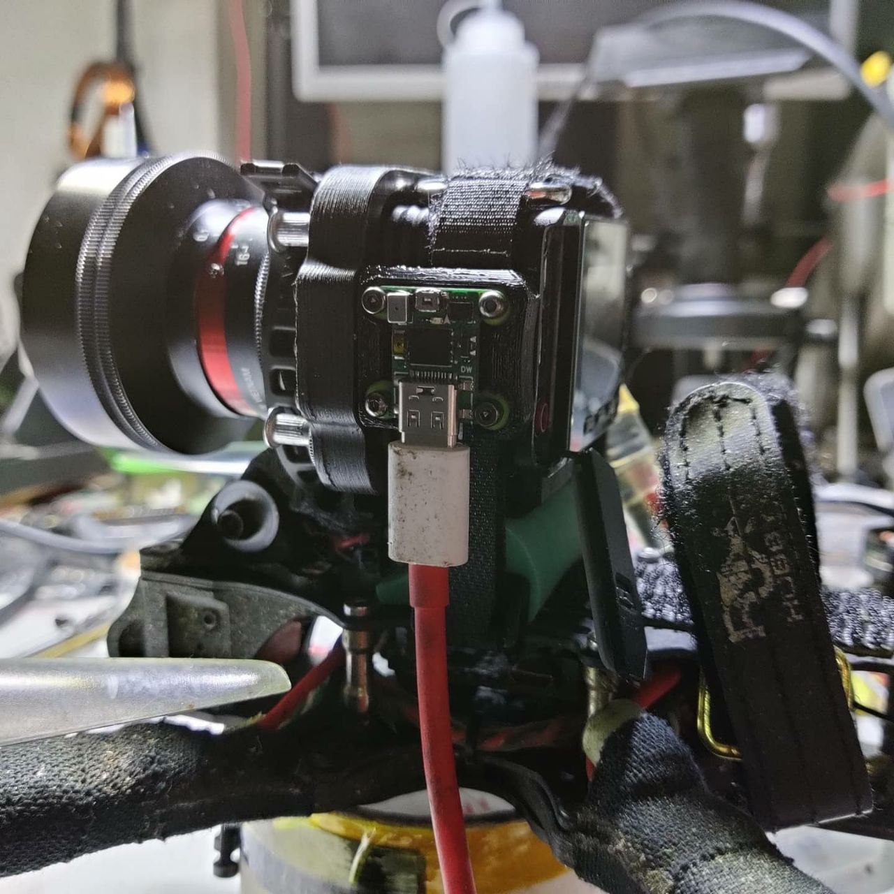

# Home

Welcome to flowbox-doc, document for flowbox hardware.

Flowbox is an extremely simplified betaflight flight controller board that integrates the creativity and ideas of the community.

It is initially thought up by DusKing \(Hugo Chiang\), and designed by pdw \(David Pawn\).

Wanna have one? Check out this Ali Express link:\[later\]!

