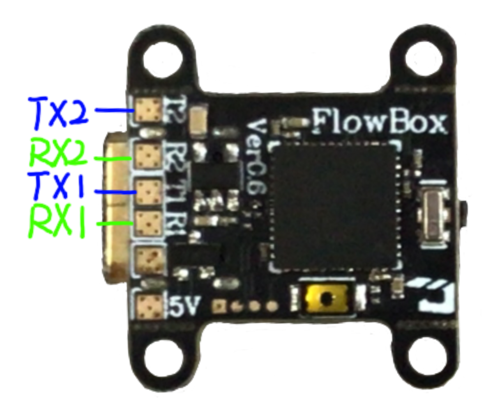
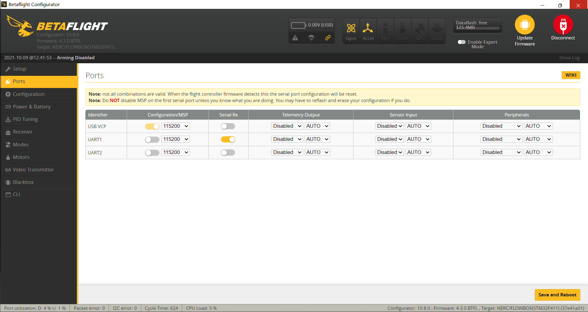
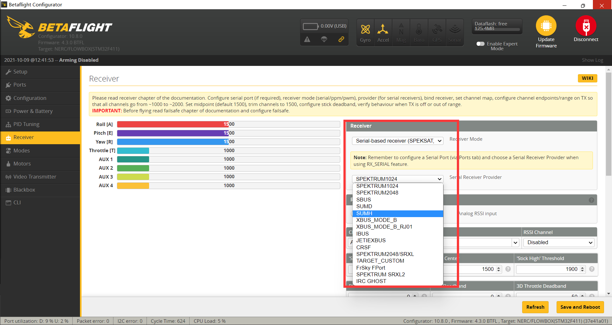

# Advance settings

## Trigger the recording

There are many ways to trigger the blackbox record, here we simply show you the mostly common used two ways.

* Triggered by receiver
* No trigger, record blackbox data automatically when power up

## Triggered by receiver

Betaflight can record blackbox when the FC was ARM. So you need to hook a serial receiver to a UART and set it up properly in betaflight configurator.

### Connecting up the UART

First of all is to hook the receiver to the flowbox.

Flowbox has two UARTs, which support a lot of serial receiver \(not included SBUS protocol\) include CRSF, iBUS, SRXL, etc. The pads are shown as below:

### Setting up the receiver in betaflight configurtor

Connect the flowbox to your PC, open betaflight configurator.

#### Set the port

#### Set the protocol

TODO

