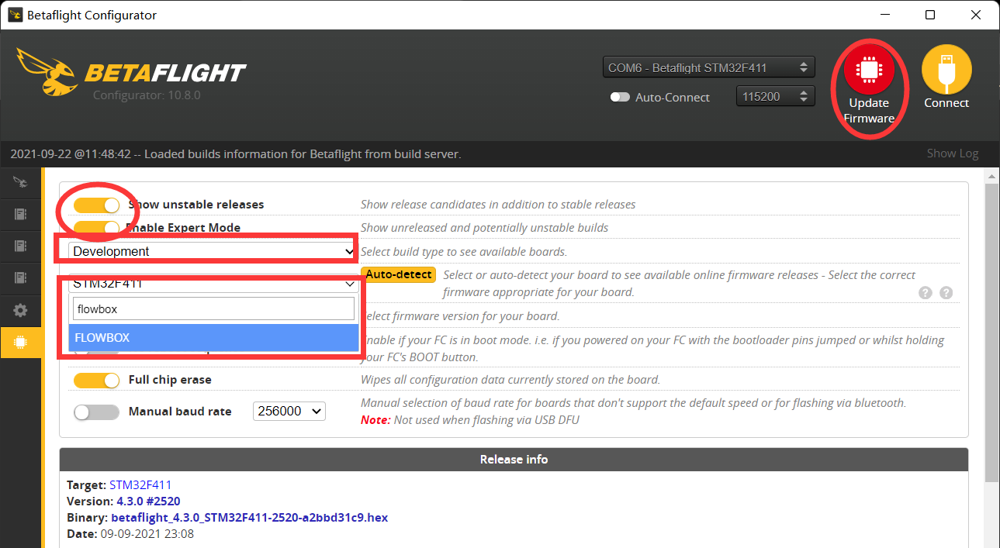
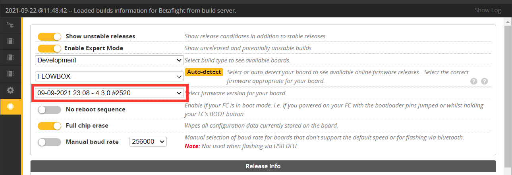
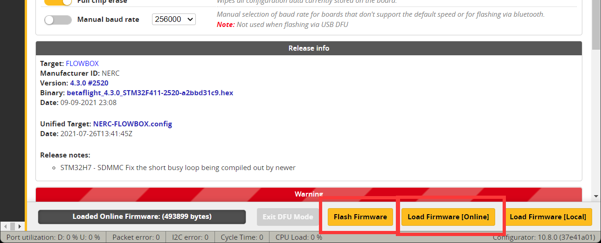
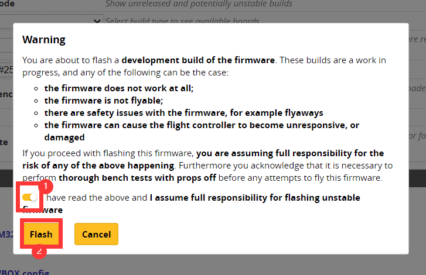
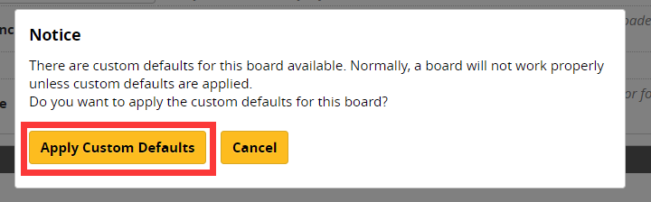
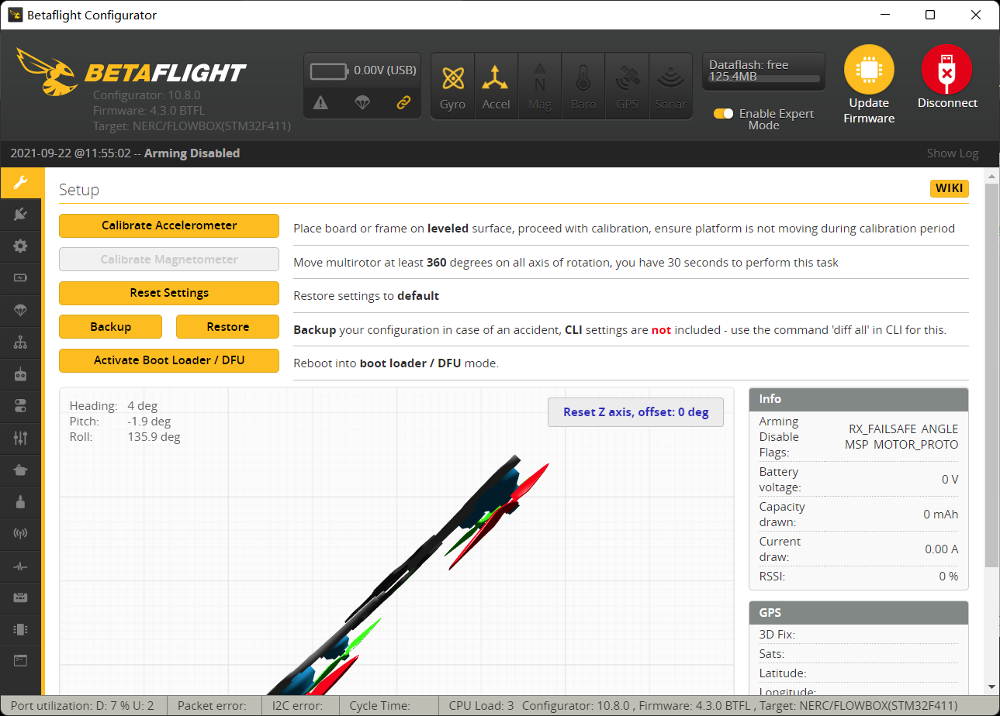

# Setup

## Flash betaflight 4.3 or newer

Since the flowbox is based on F411 MCU and BMI270 gyroscope, only betafligh 4.3 or newer firmware support it.


Currently \(betaflight 4.2.9\) you need to flash betaflight 4.3 nightly build.


### Download betaflight configrator 10.8.0 nightly build

The nightly build for betaflight configurator 10.8.0 can be found here:


[https://github.com/betaflight/betaflight-configurator-nightlies/releases](https://github.com/betaflight/betaflight-configurator-nightlies/releases)


You should choose the proper installer for you operating system that you are using. I.E. for windows 64-bit, you should choose `betaflight-configurator-installer_10.8.0-debug-<commit>_win64.exe`.

### Flash development build \(4.3 nightly\)

Now go to the Firmware Flasher tab. Turn on the "Show unstable releases" and "Expert Mode" buttons as shown:



Select the "Development" branch, and choose "FLOWBOX" target from the dropdown manual or just type and search flowbox.

Choose a build version. Here I choose \#2520 because it was the latest one.



Click the "Load firmware \[Online\]" button. Once download complete, hit the "Flash Firmware" button.



Check the checkbox in front of "I have read the above and I assume full responsibility for flashing unstable firmware", then hit the "Flash" button.



Once the flashing progress is done, try to connect. The configurator will ask you whether apply the custom default. Click "Apply Custom Default" button.



Then reconnect, whola! It works!



## Settings

In order to use flowbox as a motion recorder, there are few settings that you can fiddle with.

* Filter
* Logging traces
* Blackbox mode
* Board orientation
* Pinion input \(WIP\)

### Filters

It is recommended to use a single PT3 @80Hz on gyroscope data for this application usage.

Also, the dynamic notch filter could be quite useful for hard mounted, but this would request to config the motor protocol to be dshot 300.

```
set gyro_lowpass_hz = 0
set gyro_lowpass2_type = PT3
set gyro_lowpass2_hz = 80

set pid_process_denom = 1
set motor_pwm_protocol = DSHOT300
feature DYNAMIC_FILTER
```


This can also be done in GUI, but CLI command is easy and no bias.


Don't forget to save the settings:

```text
save
```

### Logging trace

Since flowbox was used as a secondary FC which only the gyro data is need, we can simply disable other "useless" log traces in order to save flash space and reduce log size.

```text
set blackbox_disable_pids = ON
set blackbox_disable_rc = ON
set blackbox_disable_setpoint = ON
set blackbox_disable_bat = ON
set blackbox_disable_mag = ON
set blackbox_disable_alt = ON
set blackbox_disable_rssi = ON
set blackbox_disable_acc = ON
set blackbox_disable_debug = ON
set blackbox_disable_motors = ON
set blackbox_disable_gps = ON
```

### TODO

